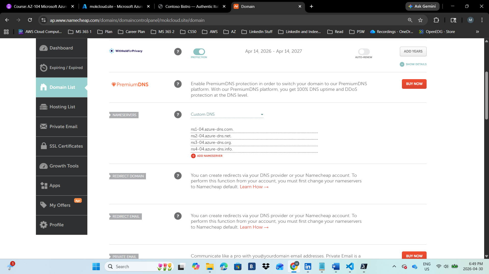

# Deployment Steps

All steps below are performed through the Azure Portal unless stated otherwise. No CLI or Terraform required.

---

## Phase 1: Build & Test the Site Locally

**Step 1:** Created the site files in VS Code then right clicked on index.html and chose "open with live server" to launch it. Confirm the site loads at 127.0.0.1:5500, styles render correctly, and the 404 page displays when you navigate to a non-existent path. Debug file path issues on Live Server before uploading.

---

## Phase 2: Create Resource Groups & Storage Account

**Step 2:** Created the resource groups

- rg-mokcloudsite-prod

- rg-dns-prod

**Step 3:** Created the Storage Accounts

- Resource group: rg-mokcloudsite-prod

- Regions: Canada Central (Primary), East US (Secondary)

- Performance: Standard

- Redundancy: Locally Redundant Storage (LRS). Front Door's cache is the real availability layer

- Check everything about soft delete and versioning. For huge website files, they will be unchecked as git's version control will make costs cheaper.

- Under the Advanced tab, enable blob anonymous access.

**Step 4:** Enabled static website hosting for both storage accounts

**Step 5:** Uploaded site files to both $web containers using CLI and after uploading, I opened the primary endpoint URL in a browser and confirmed the site renders correctly with all styles loaded.

---

## Phase 3: Create the Azure DNS Zone

**Step 6:** Created a DNS Zone.

- Resource group: rg-dns-prod

- Domain name: mokcloud.site

**Step 7:** Delegated nameservers at my registrar (Namecheap) to let my registrar know Azure is the one managing my domain now. DNS propagations take 1 – 4hours, worst case 48hours. Then I ran "nslookup -type=NS mokcloud.site" to verify it has propagated.

---

## Phase 4: Deploy Azure Front Door Standard

**Step 8:** Created the Front Door profile

**Step 9:** Create a Route, Origin Group and the origins.

- Enable Route

- Make sure origins show enabled

- Health Probes protocol set to HTTPS (when static website was enabled "Require secure transfer" was checked so only HTTPS probes will work)

- Enable caching and choose "Ignore Query String"

- Enable compression (Files between 1 to 8MB)

- Leave others as default

- Wait for provisioning state to show succeeded

**Step 10:** Added custom domains

- mokcloud.site (apex domain)

- www.mokcloud.site (www subdomain)

- While adding the domains I chose AFD managed certificates (Azure manages them for me)

- After adding the domains, I clicked "pending" under validation state and clicked "Add" to add the TXT record sets automatically to my DNS zone since I chose our DNS zone when adding the domains. Then waited for the "Approved" state.

- Certificated can take up to 48hours to propagate to every POP.

**Step 11:** Updated the route to include all domains

After everything my site refused to load

Then I waited for about 15hours before my site came to life with the custom domain being used. Definitely it was my certificate not yet being propagated to all POPs because I received a "not secure" warning.

---

## Phase 5: Monitoring & Cost Control

**Step 14:** Created a Log Analytics Workspace

- Name: log-staticsite-prod

- Region: Canada Central

- Pricing tier: Pay-as-you-go

- Resource group: rg-staticsite-prod

**Step 15:** Configured diagnostic settings on Front Door to transfer all logs and metrics to my log analytics workspace (law-mokcloud-prod)

**Step 16:** Created a Cost Management Budget alert to receive an alert when a threshold is breached

**Step 17:** Disabled the primary origin and after 5 mins the site was still up confirming failover at play.

